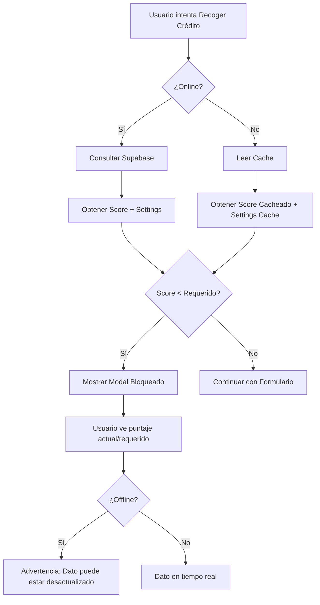

# ✅ Validación de Clientes Bloqueados - App Cobrador

## Implementación Completada (Opción 1: Híbrida)

### 🎯 Funcionalidad
- **Online**: Consulta score en tiempo real desde Supabase
- **Offline**: Usa score cacheado del último sync (con advertencia)
- **UI**: Modal informativo igual que la app principal

### 📝 Cambios Realizados

#### 1. `payment-forms.js` - Validación en Recogida de Crédito
- Líneas 105-165: Agregada validación de score al inicio de `showCollectCreditForm()`
- **Online**: Consulta `clients.score` y `settings.bloqueo_score_minimo`
- **Offline**: Lee score del cache `prestamos_detalle_cache` y settings del `panel_settings_cache`
- Bloquea si `clientScore < requiredScore`
- Muestra modal con detalle del puntaje y advertencia si es offline

#### 2. `payment-forms.js` - Modal Bloqueado
- Líneas 809-865: Función `showBlockedClientModal()` con parámetro `isOffline`
- Muestra advertencia amarilla si está offline
- Detalla score actual vs requerido
- Indica puntos faltantes
- Sugiere cómo mejorar el score

#### 3. `index.html` - Score en UI de Clientes
- Línea 2163: Agregado `score, status` al SELECT de clientes
- Líneas 1899-1906: Badge de score con colores:
  - Verde: ≥600
  - Amarillo: 500-599
  - Rojo: <500

#### 4. `index.html` - Cache de Clientes con Score
- Línea 626: Agregado `score, status` al cache de clientes
- Permite validación offline completa

### 🔄 Flujo de Validación

### ⚙️ Configuración
- **Score mínimo por defecto**: 550 puntos
- **Configurable en**: `settings.bloqueo_score_minimo`
- **Cache incluye**: `score` y `status` de cada cliente

### 📦 Peso Adicional
- ~5KB adicionales
- Sin impacto en performance offline

### ✨ Ventajas
- ✅ Precisa cuando hay conexión
- ✅ Funciona offline con último dato conocido
- ✅ UI consistente con app principal
- ✅ Advertencia clara cuando está offline
- ✅ No requiere cambios en backend

### 📝 Notas
- El score offline puede estar desactualizado si el cliente pagó recientemente
- La advertencia offline se muestra claramente al usuario
- Al sincronizar, el score se actualizará automáticamente
